# MediStock AI Frontend

**Tagline:** Streamlining medical supply chains with AI-driven insights. Connecting hospitals and vendors for optimal stock and timely delivery.

## 🌟 Preview/Outputs
#### Login Page
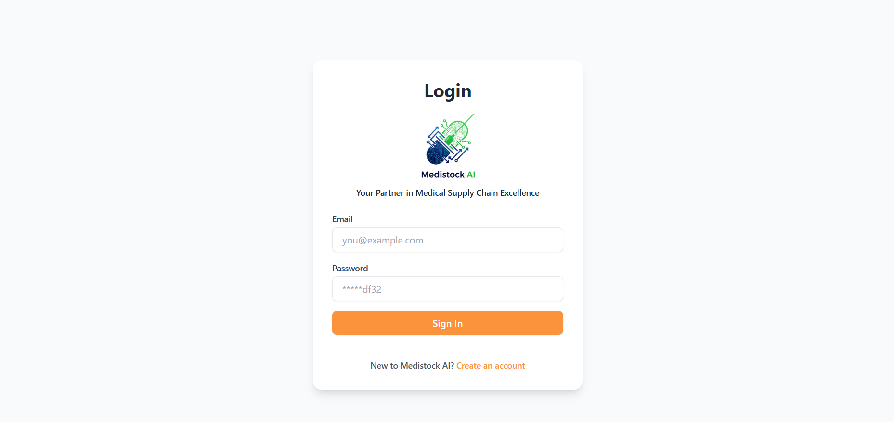
</br>
</br>
#### Register Page
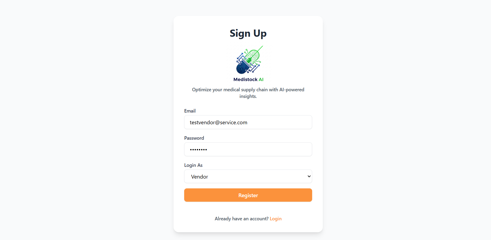
</br>
</br>
#### Vendor-Onboard Page
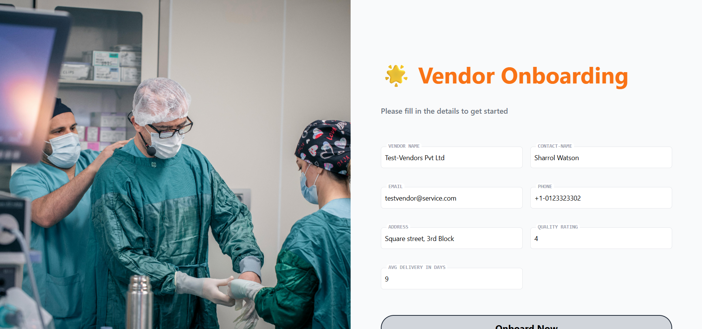
</br>
</br>
#### Hospital-Onboard Page
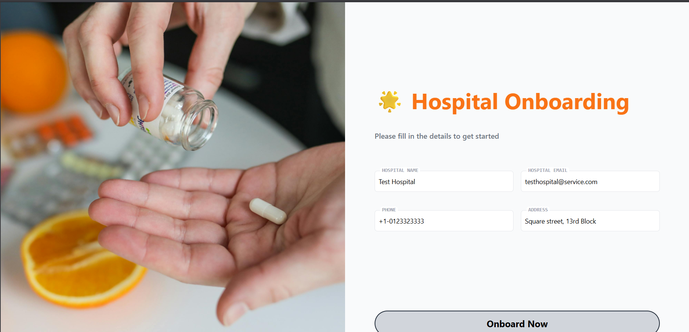
</br>
</br>
#### Vendor-Dashboard Page
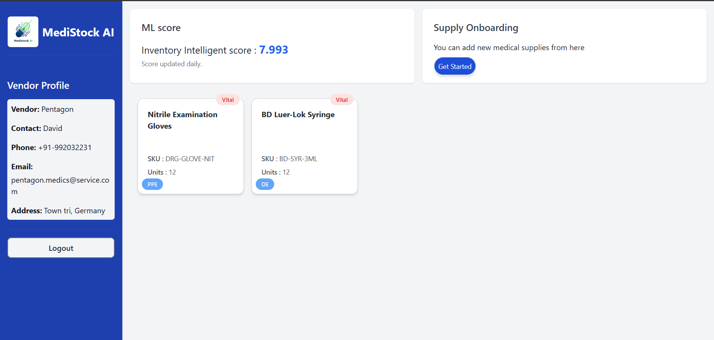
</br>
</br>
#### Hospital-Dashboard Page
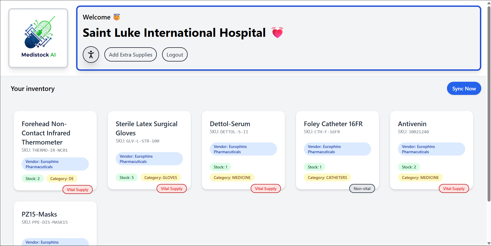
</br>
</br>
#### Vendor Adding new medical supplies
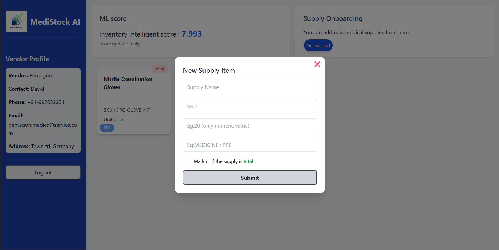
</br>
</br>
#### Vendor directory page (Seen as Hospital user)
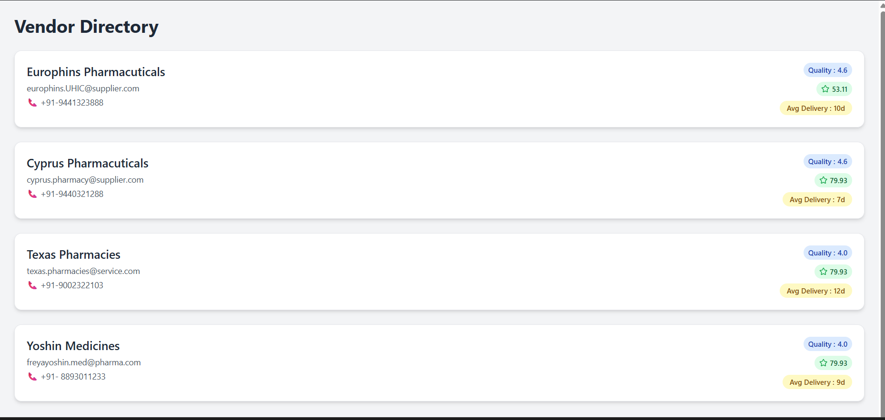
</br>
</br>
#### Vendor with Supplies (Seen as Hospital user)
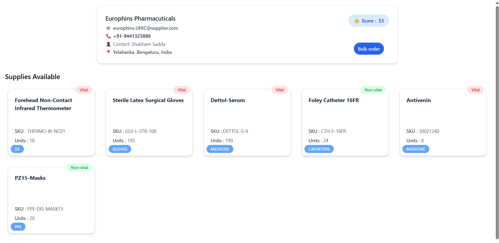
</br>
</br>
#### Vendor with no supplies (Seen as Hospital user)
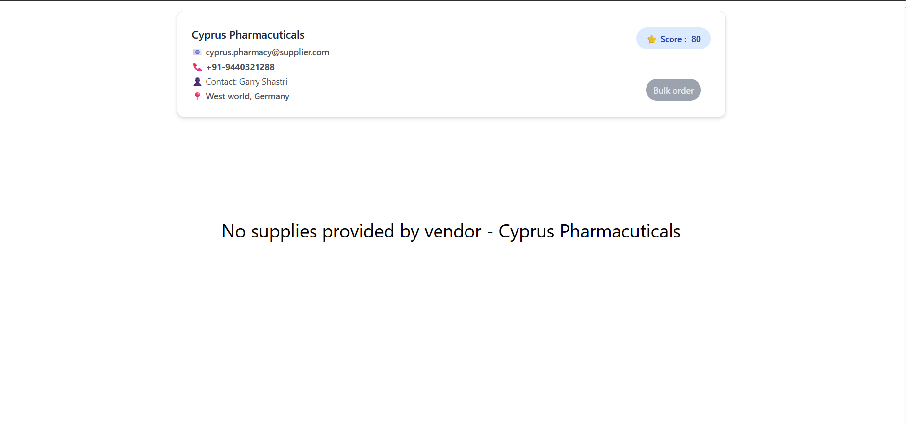
</br>
</br>
#### Hospital ordering supplies from specific vendor
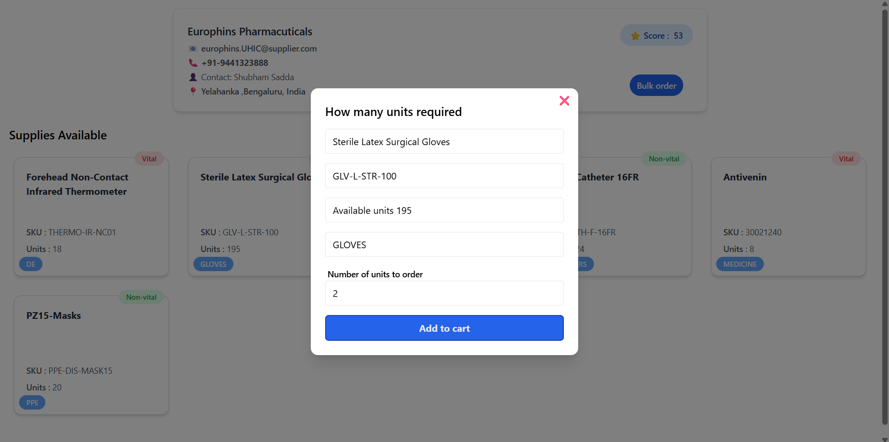


This repository contains the frontend application for **MediStock AI**, an innovative platform designed to optimize the medical supply chain. Built with modern web technologies, it provides intuitive user interfaces for both **Vendors** and **Hospitals**, facilitating efficient order management, supply item listing, and leveraging AI for smarter decision-making.

Developed with a focus on rapid prototyping and core functionality for a hackathon, this frontend demonstrates key user workflows and a responsive, clean design.

## ✨ Features

### General UI / Layout
* **Responsive Dashboard Layout:** A collapsible sidebar navigation and a dynamic main content area that adapts to various screen sizes (desktop, tablet, mobile).
* **Centralized Notification System:** Using `react-hot-toast` for user feedback.

### For Vendors
* **Vendor Dashboard Overview:**
    * Prominent display of the **current ML Worth Score**, providing an immediate performance snapshot.
    * Quick access points to essential actions.
* **Vendor Profile Management (Planned/Under Development):** Interface for vendors to view and update their company details.
* **Supply Item Management (Planned/Under Development):** Tools for vendors to list, edit, and manage the medical supplies they offer.

### For Hospitals
* **Hospital Dashboard Overview (Planned/Under Development):** Summary of pending orders and quick actions for hospital procurement.
* **Medical Supply Catalog Browse & Search (Planned/Under Development):** Interface for hospitals to search and discover medical supplies.
* **Order Placement & Tracking (Planned/Under Development):** Functionality for hospitals to place new orders and monitor their status from vendors.

## 🚀 Tech Stack

* **React:** A JavaScript library for building user interfaces.
* **TypeScript:** A typed superset of JavaScript that compiles to plain JavaScript, enhancing code quality and developer experience.
* **Tailwind CSS:** A utility-first CSS framework for rapidly building custom designs.
* **React Router DOM:** For declarative routing within the application.
* **Lucide React:** A beautiful collection of open-source icons.
* **React Hot Toast:** For lightweight and customizable notifications.

## ⚙️ Installation

To get the MediStock AI Frontend running on your local machine:

1.  **Clone the repository:**
    ```bash
    git clone [https://github.com/your-username/medistock-ai-frontend.git](https://github.com/your-username/medistock-ai-frontend.git) # Replace with your actual repo URL
    cd medistock-ai-frontend
    ```
2.  **Install dependencies:**
    ```bash
    npm install
    # or
    yarn install
    ```
3.  **Run the development server:**
    ```bash
    npm run dev
    # or
    yarn dev
    ```
    The application will typically be available at `http://localhost:5173`.

## 🌐 Usage

Once the development server is running, you can access the different parts of the application:

* **Login Page:** `/login`
* **Register Page:** `/register`
* **Vendor Onboarding:** `/vendor-onboard`
* **Hospital Onboarding:** `/hospital-onboard`
* **Vendor Dashboard:** `/vendor-dashboard` (This route showcases the core responsive layout and initial vendor features)
* **Hospital Dashboard:** `/hospital-dashboard` (This route will host the hospital-specific features)

```cmd
> npm create vite@latest ./ -- --react-ts
> npm install -D tailwindcss@3 postcss autoprefixer
> npm tailwindcss init -p
```
